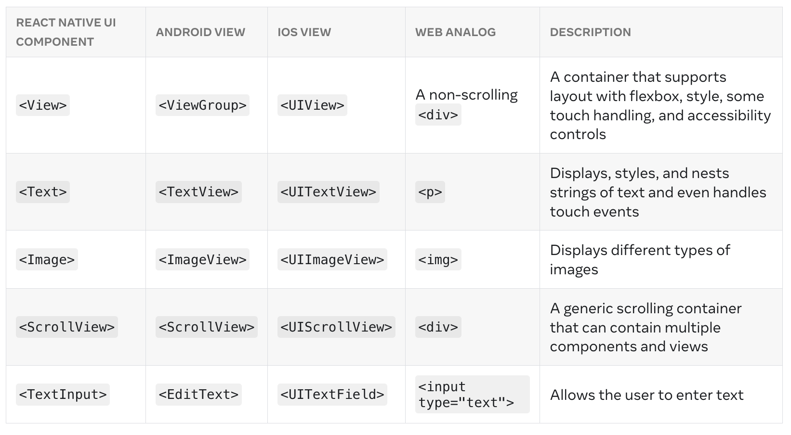
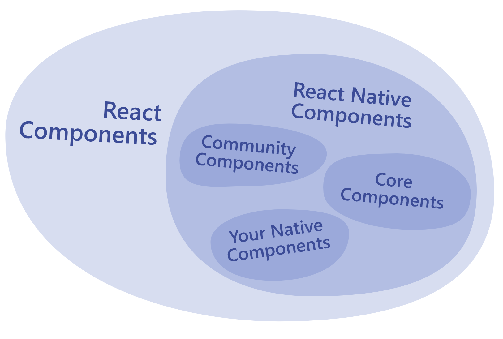

# React Native Crash Course 2024

#### <u>Créer une application RN avec epxo:</u>

```sh
npx create-expo-app my-app --template blank
```

#### Les vues et le dev mobile:

La vue est la brique de base de l'interface utilisateur dans React Native

#### Pour lancer l'application :

```
npx expo start
```

#### Ou en mode tunnel:

```sh
npx expo start --tunnel
```

### Structure de l'application:

- App : Contient les elements de navigation (file based routing). La structure du dossier app qui determine la navigation de l'application.
- assets:
- components: contient tous les composants de l'application qui ne sont pas desitnes a etre des ecrans (view).
- constants: contient les constantes de l'application. (couleurs, tailles, etc)
- hooks: contient les hooks custom de l'application.
- scripts:
- app.json: contient la configuration de l'application.
- babel.config.js: contient la configuration de babel.

### Expo CLI:

Le cli expo vous permet de lancer votre application, de la deployer, de la build, de la publier, etc.

### EAS Cli

EAS est un service de build et de deploiement d'Expo. Il permet de build des applications plus rapidement et de les deployer sur les stores.

```
npm install -g eas-cli
```

### Expo Router:

Expo Router est un router pour React Native qui permet de naviguer entre les ecrans de l'application en utilisant le systeme de fichier (Similaire a Next.js).

```sh
npx expo install expo-router react-native-safe-area-context react-native-screens expo-linking expo-constants expo-status-bar
```

### Les composants de base:

React Native est un framework qui permet de creer des applications mobiles multiplateformes en utilisant React. Il est basé sur les composants de React.

Les core components de React Native sont des composants de base qui permettent de creer des interfaces utilisateur. Ils utilisent des composants natifs pour creer des interfaces utilisateur.



En resumé, avec React Native on peut :


### En cas de modification majeure (ajoute de dependances, etc):

```sh
npx expo start -c
```
